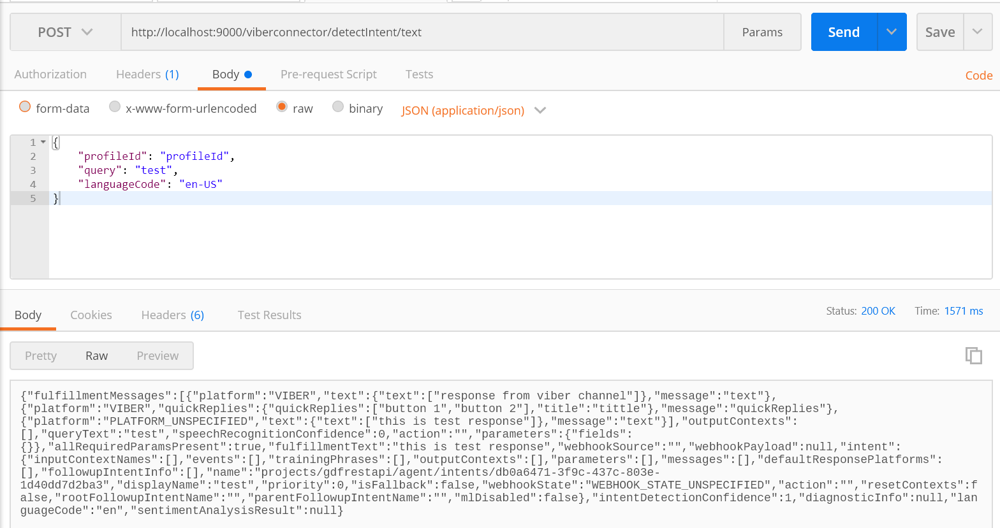

# Introduction


* In the first quarter of 2020 Google decided to remove it from their platform. 
* So to publish the Dialogflow bots to Viber we will have to use Dialogflow and Viber API to create a connector from scratch.
* Below are the few major requirements to be able to work on this project:
  * Hands on with node.js.
  * Experience working with REST API.
  * Experience using Google Dialogflow console and Dialogflow API.
  * Google Dialogflow & Viber Account.
* In this project we are going to use Dialogflow API to handle communication with Dialogflow and Viber API to handle the communication with Viber messenger.
* Note that Viber is end channel so the Dialogflow side code will remain almost same if you want to add any other channel.
* One of the important thing to consider while doing such custom integration that, we will have to handle sessions for each user.

# Dialogflow API Integration
* We are going to use API V2 only. For more details please refer [v2-overview](https://cloud.google.com/dialogflow/docs/reference/rest/v2-overview)
* We will use below Dialogflow API modules
  ```
  const dialogflow = require('dialogflow');
  ```
* Please refer [dialogflow.js](controllers/dialogflow.js) file for Dialogflow API code.
* Every message received through Viber API will be sent to Dialogflow to get the response
* Response received from Dialogflow is sent back to the user

# Viber API Integration
* Create a bot account on Viber [link](https://partners.viber.com/account/create-bot-account)
* Viber will generate unique authentication token for your bot account. Copy and store it in secure place, each request posted to Viber by the account will need to contain the token.
* For more details about Viber API please [refer](https://developers.viber.com/docs/api/rest-bot-api/#message-types)
* We will be using below Viber API modules 
  ```
  const ViberBot = require('viber-bot').Bot;
  const BotEvents = require('viber-bot').Events;
  const TextMessage = require('viber-bot').Message.Text;
  const PictureMessage = require('viber-bot').Message.Picture;
  ```
* Please refer [viber.js](controllers/viber.js) file for Viber API code.
* In order to receive the events from Viber messenger in our node.js connector we need to set up the web hook.
* Once you have your token you will be able to set your account’s web hook. This web hook will be used for receiving callbacks and user messages from Viber.
* Setting the web hook will be done by calling the set_webhook API with a valid & certified URL. This action defines the account’s web hook and the type of events the account wants to be notified about.
* For security reasons only URLs with valid and official SSL certificate from a trusted CA will be allowed. The certificate CA should be on the Sun Java trusted root certificates list.
* This will enable our application to receive the every message that user will type on Viber messenger bot

## Viber Send and receive message flow

The following diagram describes the flow of sending and receiving messages by the account. All API requests and callbacks mentioned in the diagram will be explained later in this document. Reference https://developers.viber.com/


# Session Handling
* Since we are using our own connector we have to also do the session management.
* Note that for every API request we do to Dialogflow should contain project id and session id. Project id will remain same for a bot but session id will change for every session.
* By default Dialogflow don't maintain the session and its up to the client(Viber, Facebook..etc) to manage the session for users. But Dialogflow context has default lifespan of 20 minutes. So the 20 minutes becomes our maximum timeout.
* But since we have to create and maintain the session id we can obviously keep any value for session timeout. Please refer [dialogflow_sessionid.js](controllers/dialogflow_sessionid.js) file for session management code.
* Its very simple for every incoming message if that request is received within preconfigured time then we use same session id or else we create new session id. 
* We also maintain the map of Viber user profile id and session id.

# How To Test The Application
* Clone the repository to local directory on your PC
* Rename the config-example.js to config.js and replace the config parameters like log path, JSON key values
* To know more about Dialogflow REST API and generating the JSON key please refer [Dialogflow-REST-API-Middleware](https://github.com/satishgunjal/Dialogflow-REST-API-Middleware.git)
* Now run below command to install the dependencies in the local node_modules folder
  ```
  $ npm install
  ```
* Application controller contains below files
  ```
  - dialogflow.js > contains the integration with Dialogflow REST API. Alos exports the functions which are used by viber.js and test-dialogflow.js
  - viber.js > contains the integration with Viber REST API. Consumes functions from dialogflow.js
  ```

* Test folder contains below files
  ```
  - test-index.js > Contains code to create express server
  - test-route.js > GET and POST routes configured and mapped with functions in test-dialogflow.js
  - test-dialogflow.js > Contains functions which are mapped with GET and POST routes. 'exports.detectTextIntent' function calls function from dialogflow.js
  ```
* Now to test Dialogflow API separately run below command
  ```
  $ node test\test-index.js   
  ```
 * Application should start without any error, to cross-check browse this URL : http://localhost:9000/
 
 ## Testing using postman
 
 
  
 ```
  - Method: POST
  - URL: http://localhost:9000/viberconnector/detectIntent/text
  - Body: {
            "profileId": "profileId", 
            "query": "test",
            "languageCode": "en-US"
          }

   - You should receive the fullfilment response in return
  ```
